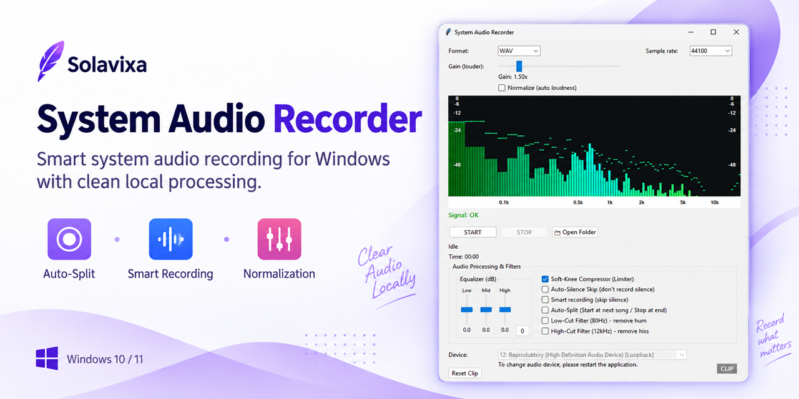

# Solavixa System Audio Recorder

**High-quality Windows system audio recording with smart local processing.**

Solavixa System Audio Recorder is a Windows desktop application designed for reliable recording of system audio directly on your computer.

## Features

- Record Windows system audio
- Smart Recording mode
- Record Everything mode
- Automatic silence handling
- Auto-Split recording
- Audio normalization
- Local processing on your Windows PC

## Download

The official Windows installer is available in the **Releases** section of this repository.

Current release: **Solavixa System Audio Recorder 2.1.0 Beta R2**

This version is currently distributed as a Beta release.

## Trial and Licensing

System Audio Recorder is proprietary commercial software.

The installer includes the Solavixa trial/licensing system. Commercial licenses are available from the official Solavixa website.

## Official Website

https://solavixa.com/products/system-audio-recorder/

## User Guides

https://solavixa.com/user-guides/

## Security

Official Solavixa Windows installers are digitally signed.

Only download Solavixa software from the official Solavixa website, Microsoft Store, or official Solavixa distribution channels.

## Copyright

Copyright © Solavixa. All rights reserved.

This repository is used for official software distribution and product information.  
The application source code is not distributed as open source.
